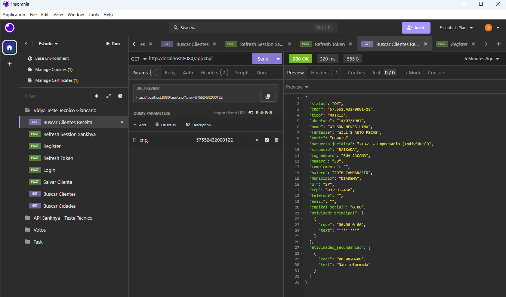
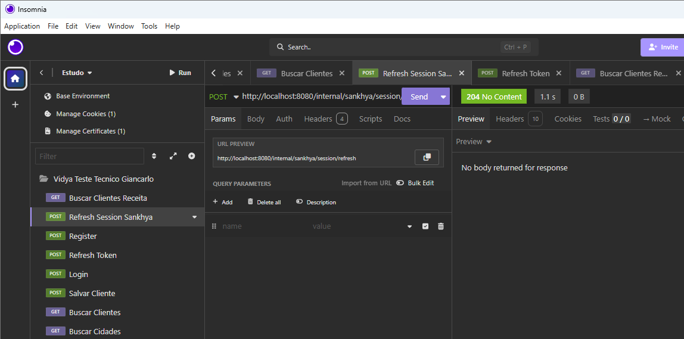
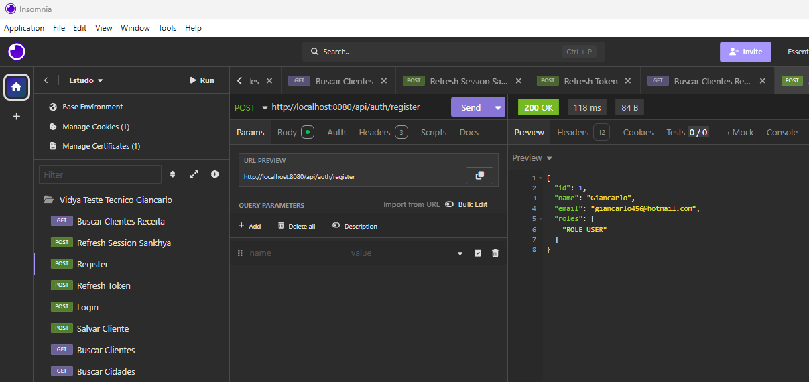
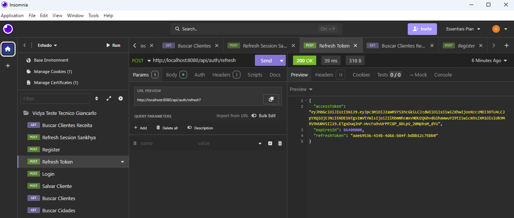
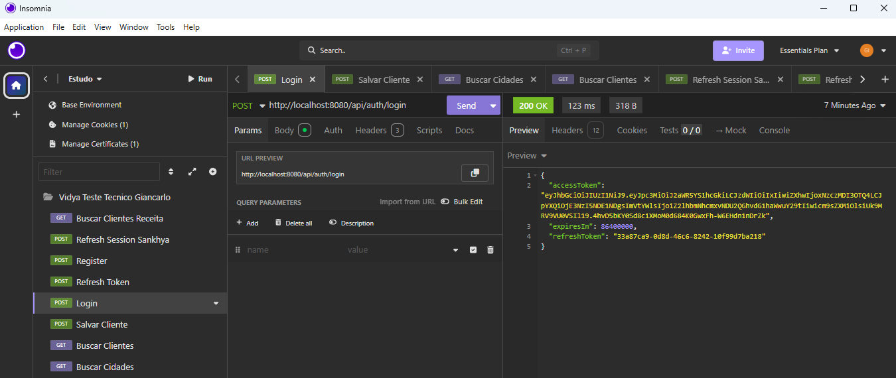
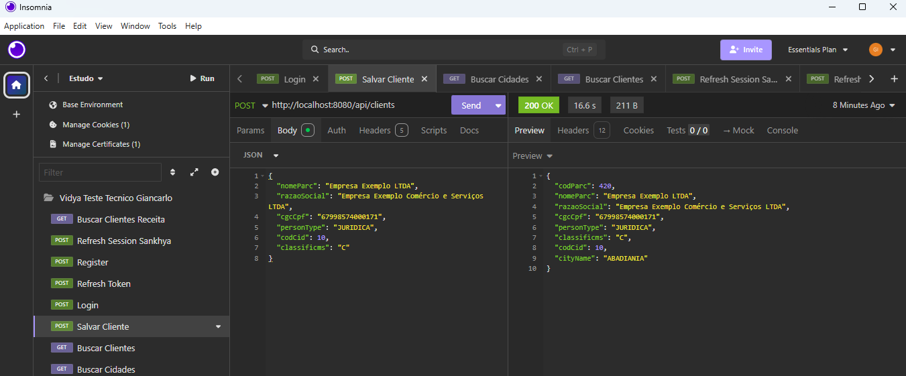
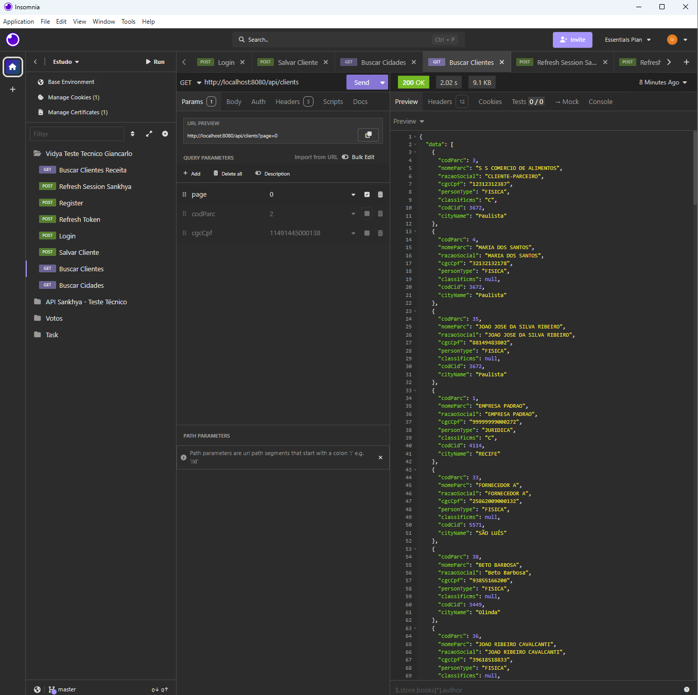
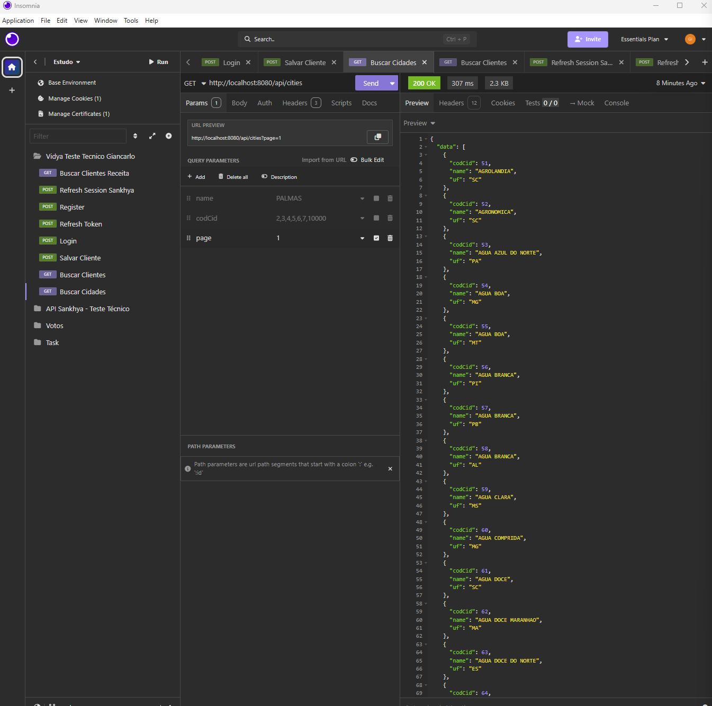

# testVC

API REST desenvolvida com Spring Boot, PostgreSQL e autenticação JWT.

---

### 🚀 Subindo a aplicação com Docker

#### Pré-requisitos

- [Docker](https://www.docker.com/get-started) instalado
- [Docker Compose](https://docs.docker.com/compose/install/) instalado

#### Passo a passo

**1. Clone o repositório**

```bash
git clone https://github.com/GiancarloJr/testVC.git
cd testVC
```

**2. Gere o `.jar` da aplicação**

```bash
mvn clean package -DskipTests
```

**3. Suba os containers**

```bash
docker-compose up --build
```

> Para rodar em segundo plano (modo detached):
> ```bash
> docker-compose up --build -d
> ```

**4. Verifique se os containers estão rodando**

```bash
docker-compose ps
```

A aplicação estará disponível em: `http://localhost:8080`

---

### 🗄️ Banco de Dados

O PostgreSQL é iniciado automaticamente pelo Docker Compose com as seguintes configurações:

| Parâmetro | Valor     |
|-----------|-----------|
| Host      | localhost |
| Porta     | 5432      |
| Database  | vidyadb   |
| Usuário   | admin     |
| Senha     | admin     |

> As migrations são executadas automaticamente pelo **Liquibase** na inicialização da aplicação.

---

### 📄 Documentação da API (Swagger)

Com a aplicação rodando, acesse a documentação interativa em:

```
http://localhost:8080/swagger-ui/index.html
```

Para autenticar no Swagger UI:
1. Clique em **Authorize** 🔒
2. Informe o token JWT no formato: `Bearer <seu_token>`

---

### 🔧 Variáveis de Ambiente

As variáveis abaixo são configuradas automaticamente pelo `docker-compose.yml`, mas podem ser sobrescritas conforme necessário:

| Variável                    | Valor padrão                              |
|-----------------------------|-------------------------------------------|
| `SPRING_DATASOURCE_URL`     | `jdbc:postgresql://postgres:5432/vidyadb` |
| `SPRING_DATASOURCE_USERNAME`| `admin`                                   |
| `SPRING_DATASOURCE_PASSWORD`| `admin`                                   |


---

### Resultados:

1. Buscar dados por CNPJ na Api da Receita:



2. Fazer refresh no JSESSIONID do Sankhya:



3. Registro de Usuario no Client:



4. Refresh Token de Usuario no Client:



5. Login no Client:



6. Salvar Cliente no Sankhya:



7. Buscar Clientes no Sankhya:



8. Buscar Cidades no Sankhya:

